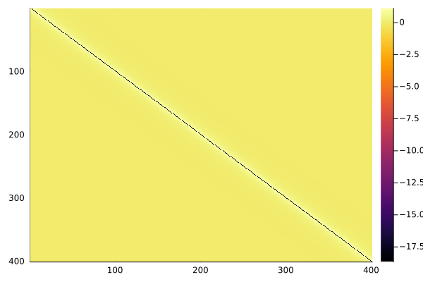

# Dynamical_Potential.jl

Julia solver of the the non-causal dynamical equations derived in

- P. Charbonneau, G. Folena, E. M. Malatesta, T. Rizzo, F. Zamponi,  
  *Rare Trajectories in a Prototypical Mean-field Disordered Model: Insights into Landscape and Instantons*,  
  arXiv:2505.00107 (2025).

that describe instanton processes in Random First Order Mean Field models via the analysis of a dynamical analog of the
Franz-Parisi potential. In particular the system starts from an equilibrium initial condition sampled at inverse temperature `β`; it then 
evolves with Langevin dynamics at inverse temperature `β2` for a time window `τf` where the trajectory is constrained 
to have overlap `S` with the initial configuration.

The solver finds a root of the (discretized) dynamical equations using a (damped) Newton method.
At each Newton iteration one needs to solve a large linear system

    J(op) * d(op) = - F(op)

where `F(op)` is the vector of dynamical equations and `J(op)` its Jacobian. This code computes the
Newton step `d(op)` with **GMRES** in a **matrix-free** fashion: only Jacobian–vector products are
evaluated.

The equations are written and solved here for the pure p-spin spherical model.
This model dependence is encapsulated in the “interaction function”:

```julia
f(x, p) = x^p
```

## Files

- `Dynamical_Potential.jl`: Main module (`module P`) implementing:
    - the discretized dynamical equations: `computeEquations(...)` (and the call overload `op(ep)`)
    - the Jacobian–vector product: `compute_jacobian(...)`
    - the Krylov solver for Newton steps: `GMRES(...)`
    - the outer Newton loop: `converge!(...)` and the convenience wrapper `converge(...)`
    - parameter sweeps + I/O helpers: `span!`, `span`, `readparams_*`, `output_dataframes`, ...

- `utils.jl`: file containing data structures and utilities used by the solver:
  - `OrderParams` struct: stores all the Correlation/Response functions and the causal susceptibilities;
  - `ExtParams` struct: stores the external parameters and discretization parameters;
  - `Params` struct: contains parameters used by the GMRES and Newton algorithms;
  - compression/decompression helpers `conv(...)` / `iconv(...)` (used inside GMRES)
  - matrix symmetrization `halfsym!(...)`, Krylov scalar product `scalar_product(...)`
  - resampling helpers for changing the grid size (`full_resample`, `resample`, ...)

---

## Requirements

- Julia (tested on recent Julia 1.x; 1.9+ recommended).
---

# Usage example

From a Julia REPL you can solve the dynamical equations 


All the dependencies to run the code can be installed automatically using Julia’s package manager. From the Julia REPL, 
type `]` to enter the Pkg REPL mode and run


```julia
pkg> activate .
pkg> instantiate
```

You can then solve the dynamical equations for `p=3`, `β=β2=1.695`, `τf=10.0`, `S=0.65`
with a number of points of 200 grid points using GMRES by running:

```julia

julia> op, ep = DP.span(
                  p=3, β=1.695, β2=1.695, τf=10.0, n=200, S=0.65,
                  nKrylov=200, ϵ=1e-4, ψ=0.0, maxiters=200,
                  compression=:half
              );
# NEW ITER: p=3   β=1.695   β2=1.695   τf=10.0   n=200   S=0.65
it=1
 Δ=0.05300906697405486
 Δeq = 0.0006217148894780422
it=2
 Δ=0.010365104069763601
 Δeq = 1.7566248141420715e-5
it=3
 Δ=0.0015950045305349663
 Δeq = 1.7977926425327695e-6
it=4
 Δ=0.00011629252899352127
 Δeq = 1.0812601747289818e-7
it=5
 Δ=6.849098313327863e-6
 Δeq = 1.2402767035624152e-8
183.446549 seconds (35.51 M allocations: 295.842 GiB, 1.64% gc time, 1.06% compilation time)


```

where
 - `ψ`: damping factor for the Newton's update;
 - `ϵ`: precision tolerance for the solution of the equations; 
 - `maxiters`: maximum number of Newton's updates;
 - `verb`: verbosity;
 - `nKrylov`: size of the Krylov base. Note that an higher value of `nKrylov` increases memory consumption, but it may speed up Newton's convergence as the Newton's step is evaluated more precisely;
 - `compression`: solves the equations using a compressed version of the OrderParams; two compression methods are implemented `compression ∈ [:half, :lossy]` see later for additional details;
 - `save_file`: if `true` and the solution to the equation is found, saves the structs `op`, `ep`, `pars` into a serialized file named `FP_β$(ep.β)_n$(ep.n)_τf$(ep.τf)_S$(ep.S)_ls$(pars.lossyscale)_nK$(pars.nKrylov).txt`. 

Note that the printed output `Δ` and `Δeq` represents respectively the maximum absolute value of the Newton's 
step update `d(op)` and of the vector of dynamical equations `F(op)`. A solution of the dynamical equations
is considered found when `Δ <= ϵ`. 

The function `span` outputs the struct of `OrderParams` at convergence and the `ExtParams` used. If the `save_file` flag was used to save the solution you can retrieve it back using the `readparams_all` function and plot the correlation as follows

```julia

julia> using Plots
julia> op, ep, pars = DP.readparams_all("FP_β1.695_n200_τf10.0_S0.65_ls0_nK200.txt");
julia> heatmap(op.𝓒[1:2ep.n+1, 1:2ep.n+1], yflip = true)

```

This will give generate the figure below.

<p align="center">
  
</p>

Similarly the *response functions* and the *causal susceptibilities* can be plotted as follows

```julia

julia> heatmap(op.𝓒[1:2ep.n+1, 2ep.n+2:2*(2ep.n+1)], yflip = true)
julia> heatmap(op.𝓒[2ep.n+2:2*(2ep.n+1), 2ep.n+2:2*(2ep.n+1)], yflip = true)

```


<p align="center">
  
</p>
<p align="center">
  
</p>


## Compression (memory-saving) options

Many objects are time–time correlation/response matrices, which can be large for big number of grid points `n`. 
The keyword `compression` controls how the set of  is stored internally inside GMRES/Newton:

- `compression = :half`: stores half of the symmetric correlation blocks (exploiting $C(t,t')=C(t',t)$ and analogous symmetries),
while keeping the required response block. Solves the exact discretized equations, just with reduced memory usage.

- `compression = :lossy`: uses a coarser effective time step where possible (i.e. increases the step size in the bulk) while keeping
higher resolution near the regions where it matters most. The compression is controlled by 

  - `dlossy`: size of the "high-resolution" region kept around the sensitive parts of the functions
  - `lossyscale`: coarsening factor (larger → more compression)

contained in the struct `Params`. This can significantly reduce memory (and sometimes speed up GMRES/Newton), at the cost of a 
controlled approximation.


# Citing
This code is free to use. If you use it in academic work, please cite:

```
@article{charbonneau2025rare,
  title={Rare Trajectories in a Prototypical Mean-field Disordered Model: Insights into Landscape and Instantons},
  author={Charbonneau, Patrick and Folena, Giampaolo and Malatesta, Enrico M and Rizzo, Tommaso and Zamponi, Francesco},
  journal={arXiv preprint arXiv:2505.00107},
  year={2025}
}
```